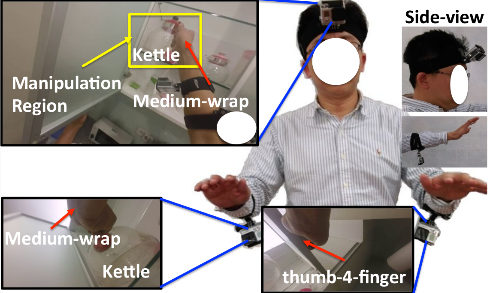

<center>

</center>

# Deep Classification


## Brief
* ***+2 extra credit of the whole semester***
* Due: <b>Oct. 5</b>, 11:59pm.
* Required files: results/index.md, and code/
* [Project reference](http://aliensunmin.github.io/project/handcam/)


## Overview


Recently, the technological advance of wearable devices has led to significant interests in recognizing human behaviors in daily life (i.e., uninstrumented environment). Among many devices, egocentric camera systems have drawn significant attention, since the camera is aligned with the field-of-view of wearer, it naturally captures what a person sees. These systems have shown great potential in recognizing daily activities(e.g., making meals, watching TV, etc.), estimating hand poses, generating howto videos, etc.

Despite many advantages of egocentric camera systems, there exists two main issues which are much less discussed. Firstly, hand localization is not solved especially for passive camera systems. Even for active camera systems like Kinect, hand localization is challenging when two hands are interacting or a hand is interacting with an object. Secondly, the limited field-of-view of an egocentric camera implies that hands will inevitably move outside the images sometimes.
     
HandCam (Fig. 1), a novel wearable camera capturing activities of hands, for recognizing human behaviors. HandCam has two main advantages over egocentric systems : (1) it avoids the need to detect hands and manipulation regions; (2) it observes the activities of hands almost at all time.
     
## Requirement   

- Python
- [TensorFlow](https://github.com/tensorflow/tensorflow)

## Data

### Introduction

This is a [dataset](https://drive.google.com/drive/folders/0BwCy2boZhfdBdXdFWnEtNWJYRzQ) recorded by hand camera system.

The camera system consist of three wide-angle cameras, two mounted on the left and right wrists to
capture hands (referred to as HandCam) and one mounted on the head (referred to as HeadCam).

The dataset consists of 20 sets of video sequences (i.e., each set includes two HandCams and one
HeadCam synchronized videos) captured in three scenes: a small office, a mid-size lab, and a large home.)

We want to classify some kinds of hand states including free v.s. active (i.e., hands holding objects or not),
object categories, and hand gestures. At the same time, a synchronized video has two sequence need to be labeled,
the left hand states and right hand states.

For each classification task (i.e., free vs. active, object categories, or hand gesture), there are forty
sequences of data. We split the dataset into two parts, half for training, half for testing. The object instance is totally separated into training and testing.

### Zip files

`frames.zip` contains all the frames sample from the original videos by 6fps.

`labels.zip` conatins the labels for all frames.

FA : free vs. active (only 0/1)

obj: object categories (24 classes, including free)

ges: hand gesture (13 gestures, including free)


### Details of obj. and ges.

```
Obj = { 'free':0,
        'computer':1,
        'cellphone':2,
        'coin':3,
        'ruler':4,
        'thermos-bottle':5,
        'whiteboard-pen':6,
        'whiteboard-eraser':7,
        'pen':8,
        'cup':9,
        'remote-control-TV':10,
        'remote-control-AC':11,
        'switch':12,
        'windows':13,
        'fridge':14,
        'cupboard':15,
        'water-tap':16,
        'toy':17,
        'kettle':18,
        'bottle':19,
        'cookie':20,
        'book':21,
        'magnet':22,
        'lamp-switch':23}

Ges= {  'free':0,
        'press'1,
        'large-diameter':2,
        'lateral-tripod':3,
        'parallel-extension':4,
        'thumb-2-finger':5,
        'thumb-4-finger':6,
        'thumb-index-finger':7,
        'precision-disk':8,
        'lateral-pinch':9,
        'tripod':10,
        'medium-wrap':11,
        'light-tool':12}
```

### Split of the dataset
```
train_set = [['office', 'leftD1'], ['office', 'leftD2'], ['office', 'leftD3'], 
              ['house', 'leftD1'], ['house', 'leftD2'], ['house', 'leftD3'], 
              ['lab', 'leftD1'], ['lab', 'leftD2'], ['lab', 'leftD6'], ['lab', 'leftD7'], 
              ['office', 'rightD1'], ['office', 'rightD2'], ['office', 'rightD3'], 
              ['house', 'rightD1'], ['house', 'rightD2'], ['house', 'rightD3'], 
              ['lab', 'rightD1'], ['lab', 'rightD2'], ['lab', 'rightD6'], ['lab', 'rightD7']]


test_set = [['office', 'leftD4'], ['office', 'leftD5'], ['office', 'leftD6'], 
             ['house', 'leftD4'], ['house', 'leftD5'], ['house', 'leftD6'], 
             ['lab', 'leftD3'], ['lab', 'leftD4'], ['lab', 'leftD5'], ['lab', 'leftD8'], 
             ['office', 'rightD4'], ['office', 'rightD5'], ['office', 'rightD6'], 
             ['house', 'rightD4'], ['house', 'rightD5'], ['house', 'rightD6'], 
             ['lab', 'rightD3'], ['lab', 'rightD4'], ['lab', 'rightD5'], ['lab', 'rightD8']]
```

## Writeup
    
You are required to implement a **deep-learning-based method** to recognize hand states (free vs. active hands, hand gestures, object categories). Moreover, You might need to further take advantage of both HandCam and HeadCam. You will have to compete the performance with your classmates, so try to use as many techniques as possible to improve. **Your score will based on the performance ranking.**

For this project, and all other projects, you must do a project report in results folder using [Markdown](https://help.github.com/articles/markdown-basics). We provide you with a placeholder [index.md](./results/index.md) document which you can edit. In the report you will describe your algorithm and any decisions you made to write your algorithm a particular way. Then, you will describe how to run your code and if your code depended on other packages. You also need to show and discuss the results of your algorithm. Discuss any extra credit you did, and clearly show what contribution it had on the results (e.g. performance with and without each extra credit component).

You should also include the precision-recall curve of your final classifier and any interesting variants of your algorithm.

## Rubric
<ul>
   <li> 40 pts: According to performance ranking in class </li>
	<li> 60 pts: Outperform the AlexNet baseline </li>
   <li> -5*n pts: Lose 5 points for every time (after the first) you do not follow the instructions for the hand in format </li> 
</ul> 

## Get start & hand in
* Publicly fork version (+2 extra points)
	- [Fork the homework](https://education.github.com/guide/forks) to obtain a copy of the homework in your github account
	- [Clone the homework](http://gitref.org/creating/#clone) to your local space and work on the code locally
	- Commit and push your local code to your github repo
	- Once you are done, submit your homework by [creating a pull request](https://help.github.com/articles/creating-a-pull-request)

* [Privately duplicated version](https://help.github.com/articles/duplicating-a-repository)
  - Make a bare clone
  - mirror-push to new repo
  - [make new repo private](https://help.github.com/articles/making-a-private-repository-public)
  - [add aliensunmin as collaborator](https://help.github.com/articles/adding-collaborators-to-a-personal-repository)
  - [Clone the homework](http://gitref.org/creating/#clone) to your local space and work on the code locally
  - Commit and push your local code to your github repo
  - I will clone your repo after the due date

## Credits
Assignment designed by Cheng-Sheng Chan. Contents in this handout are from <a href="https://drive.google.com/file/d/0BwCy2boZhfdBM0ZDTV9lZW1rZzg/view">Chan et al.</a>.
