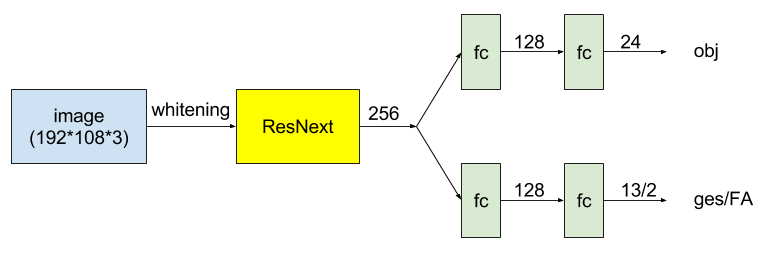
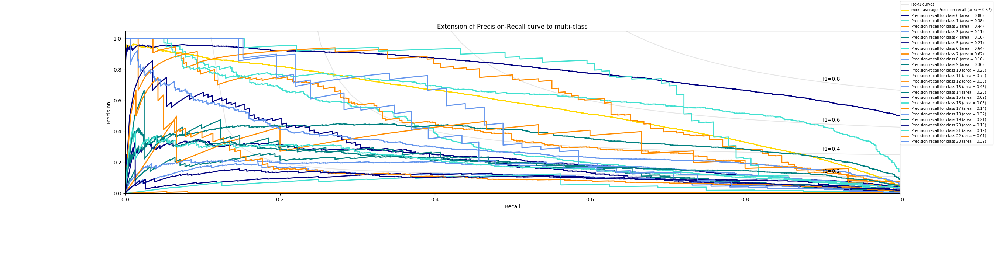
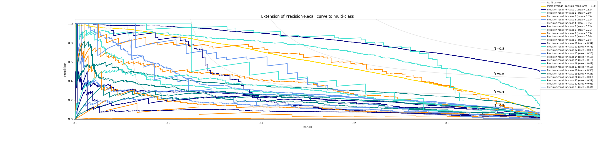

# CEDL2017 HW1 Report: Deep Classification <span style="color:red">(105061585)</span>

## Overview
The project is related to classification using Tensorflow and modified from the code of [wenxinxu/ResNeXt-in-tensorflow](https://github.com/wenxinxu/ResNeXt-in-tensorflow)
- `main.py`: Do training or testing.
- `data_input.py`: Processing data io.
- `hyper_parameters.py`: Set up the hyper parameters.
- `resNeXt.py`: Define the [ResNext](https://arxiv.org/pdf/1611.05431.pdf) model.
- `plotPRcurve.py`: Plot the precision and recall curve.

## Implementation
### Model Architectures
This project use the [ResNext](https://arxiv.org/pdf/1611.05431.pdf) as the backbone model.
And appends fc layers to do classification. The input is only hand image.



The full model is trained from scratch.
### Loss
Jointly minimize the sum of cross-entroy losses of the 2 taskes.
We choose one of FA or ges to act as auxiliary loss.
```
loss = k * loss_fa_or_ges + (1-k) * loss_obj
```
### Other detail
* Random left-right fliping the image at 50% probability while training 
* Random crop to size of W*H
* Image whitening: Linearly scales image to have zero mean and unit norm.


## Installation
* [pandas](http://pandas.pydata.org/)
* [scikit-image](http://scikit-image.org/docs/dev/install.html)

1. Download this project code.
2. Download [dataset](https://drive.google.com/drive/folders/0BwCy2boZhfdBdXdFWnEtNWJYRzQ)(`frames/` and `labels/`) and place them to this project folder `dataset/`.
3. Convert the training data to tfRecord format to speed up the training (cost 46 GB space). `python data_input`
4. For training from script: `python main.py --mode=train --version='model_1'` The training logs, checkpoints, and error.csv file will be saved in the folder with name logs_$version
4. For continuing training: 
* replace the **is_use_ckpt** FLAGS in `hyper_parameters.py` to **True**
* and replace the **ckpt_path** FLAGS in `hyper_parameters.py` with your path to the ckpt (ex: 'logs_oh,mfc_c=2_d=64_n=2_lr=0.1_lrd=0.0004_wd=0.0007_k=0.5/model.ckpt-39800')
* then `python main.py --mode=train` 
4. For testing: 
* replace the **test_ckpt_path** FLAGS in `hyper_parameters.py` with your path to the ckpt (ex: 'logs_onlyhand_c=3_b=15/model.ckpt-39999')
* then run `python main.py --mode=test`
5. Plot the PR curve: after run the testing, run `python plotPRcurve.py`


### Results
- c: cardinality
- d: depth
- n: number of resblock in a conv. stage
- lr: learning rate
- lrd: decay rate of learning rate
- wd: weight decay rate (L2)
- k: loss = k * loss_fa_or_ges + (1-k) * loss_obj
- H: image height
- W: image width
- m: # neurons in fc layer
- batch size: 15
- epoch: ~ 20

| Label | Hyper-para | Accuracy |
|-------|----------|----------|
|obj + FA| `W=192_H=108_m=128_c=4_d=32_n=3_lr=0.05_lrd=0.004_wd=0.0007_k=0.5`| 0.512 |
|obj + FA| `W=192_H=108_m=128_c=2_d=64_n=2_lr=0.05_lrd=0.0004_wd=0.0007_k=0.5`| 0.529 |
|obj + ges| `W=192_H=108_m=128_c=4_d=32_n=3_lr=0.001_lrd=1_wd=0.0005_k=0.5`| 0.548 |
|obj + ges| `W=224_H=224_m=256_c=3_d=32_n=3_lr=0.001_lrd=1_wd=0.0005_k=0.4`| 0.562 |

obj + ges	W=192_H=108_m_128_c=4_d=32_n=3_lr=0.001_lrd=1_wd=0.0005_k=0.5:


obj + ges	W=224_H=224_m=256_c=3_d=32_n=3_lr=0.001_lrd=1_wd=0.0005_k=0.4:

